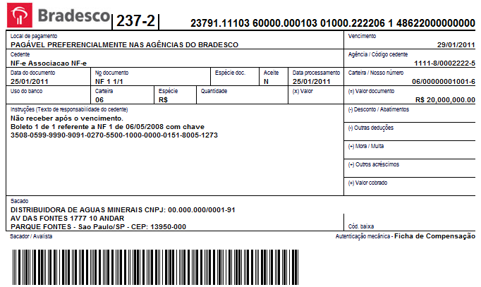

# Tarefa 2 de Programação Funcional e Lógica

# Visão geral

Nesta tarefa você deverá implementar funções de manipulação de número de boleto bancário brasileiro, de maneira a praticar a construção de funções simples em Haskell. 

# Descrição



O [boleto bancário brasileiro](https://pt.wikipedia.org/wiki/Boleto_banc%C3%A1rio) pode ser identificado por um de dois números:

* **Linha digitável**:  é um identificador com 47 números que aparece no topo do boleto bancário que é projetado para facilitar a digitação por humanos.
* **Código de barras**: é um identificador com 44 números representado no boleto pelo código de barras bidimensional que é projetado para a leitura automática por dispositivos eletrônicos.

Ambas as identificações traduzem um mesmo boleto bancário e possuem o mesmo conjunto de informações que, entretanto, é traduzida em números de maneiras diferentes. Esta tarefa envolve unicamente a interpretação da **linha digitável** e por isso você deve ter **cuidado para não implementar** a manipulação do código de barras (tenha cuidado ao procurar informações de outras fontes além desta descrição).

Por exemplo, as seguintes "linha digitável" e "código de barras" representam o mesmo boleto:

```
		00190.50095 40144.816069 06809.350314 3 37370000000100 - linha digitável
		00193373700000001000500940144816060680935031 - código de barras
```

## Estrutura da Linha Digitável

Considere a seguinte estrutura dos 47 número da "linha digitável":

		+-------------+--------------+--------------+---------+----------------+
		|   Campo 1   |   Campo 2    |   Campo 3    | Campo 4 |    Campo 5     |
		+-------------+--------------+--------------+---------+----------------+
		| AAABC.CCCCX | DDDDD.DDDDDY | EEEEE.EEEEEZ | K       | UUUUVVVVVVVVVV |
		+-------------+--------------+--------------+---------+----------------+

Os números devem ser interpretados da seguinte maneira:

* `AAA`: posições 1 a 3 identificam o banco de acordo com um identificador único atribuído a cada banco. Por exemplo, "001" é Banco do Brasil e "237" é Bradesco (você encontra os códigos de todos os banco [aqui](https://www.febraban.org.br/associados/utilitarios/bancos.asp)).
* `B`: posição 4 identifica a moeda aplicada ao boleto, que é usualmente "9", código do real.
* `X`: posição 10 é o dígito verificador das informações do "Campo 1".
* `Y`: posição 21 é o dígito verificador das informações do "Campo 2".
* `Z`: posição 31 é o dígito verificador das informações do "Campo 3".
<!-- * `DDDDD.DDDDD`: posições 11 a 20 identificam o valor do boleto, multiplicado por 100. Então se os número são `00009.13499` então o valor do boleto é R$ 9.134,99 (considerando que moeda é real). -->
* `UUUU`: posições 34 a 37 é o fator de vencimento, que indica a data de vencimento do boleto na forma de número de dias após 7/10/1997. 
* `VVVVVVVVVV`: posições 38 a 47 identificam o valor do boleto, multiplicado por 100. Então se os número são `0000913499` então o valor do boleto é R$ 9.134,99 (considerando que moeda é real).
* `DDDDD.DDDDD`, `K` e `CCCCC`: a interpretação dessas posições é definida pelo banco ou é uma porção do código de barras e por este motivo não serão consideradas nesta tarefa. Você deve apenas considerar que eles serão fornecidos para você.


## Tarefas de Implementação

Dado um código de boleto bancário na representação de linha digitável (números que aparecem no boleto), você deverá implementar funções que retornem:

* Se o boleto é válido, ou seja, se os dígitos verificadores dos três campos (`X`, `Y` e `Z`) estão corretos.
* Data de vencimento de um boleto
* Valor de um boleto
* Banco associado ao boleto

### Cálculo do fator de vencimento

O fator de vencimento indica a data de vencimento do boleto a forma de número de dias após 7 de outubro de 1997. Se o fator de vencimento é `0001` então a data de vencimento é 8 de outubro de 1997 e assim por diante, como no exemplo mostrado na tabela.

<!--
Fator	Data de Vencimento
1000	03/07/2000
1001	04/07/2000
1002	05/07/2000
9999	21/02/2025
-->

| Fator | Data de Vencimento |
|-------|--------------------|
| 1000  | 03/07/2000         |
| 1001  | 04/07/2000         |
| 1002  | 05/07/2000         |
| 9999  | 21/02/2025         |


Há algumas regras adicionais para avaliar o fator de vencimento a partir de 21/02/2025, mas elas não serão consideradas nesta tarefa.

### Cálculo dos Dígitos Verificadores

Para o cálculo dos digitos verificadores de cada campo, cada número deve ser multiplicado por um "multiplicador" (1 ou 2), resumido em um número de um dígito (ver `resumeDigito`) e somados entre si. Do valor total, é extraído o resultado da divisão inteira e o resto (`R`). O valor do dígito é `(10-R) mod 10`. 

A função `resumeDigito`, que transforma um número de dois dígito em um dígito, soma o valor da dezena com a unidade, até que o resultado seja um número de um dígito.

O multiplicador é uma sequência de alternada de "2" e "1", iniciando por "2", a associada às respectivas posições dos números do código, **excluindo** as posições dos dígitos verificadores. 

		00190.50095 40144.816069 06809.350314 3 37370000000100
		Campo 1     Campo 2      Campo 3
		00190.50095 40144.816069 06809.350314
		21212 1212  12121 21212  12121 21212     <--- multiplicador

Para o "campo 2":

1. Aplicação do multiplicador: 

		4x1 + 0x2 + 1x1 + 4x2 + 4x1 + 8x2 + 1x1 + 6x2 + 0x1 + 6x2
		4   + 0   + 1   + 8   + 4   + 16  + 1   + 12  + 0   + 12

2. Aplicação do `resumeDigito`, totalizando 31.
 
		4 + 0 + 1 + 8 + 4 + 16    + 1 + 12    + 0 + 12
		4 + 0 + 1 + 8 + 4 + (1+6) + 1 + (1+2) + 0 + (1+2) = 31

3. Obtenção do resto

		31 mod 10 = 1

4. Cáculo do valor do dígito (que deve gerar o mesmo número na posição 21 da linha digitável)

		(10 - 1) mod 10 = 9

Você encontra uma demonstração completos para o cálculo dos campos 1, 2 e 3 para essa linha digitável no extrado da [especificação do boleto do banco do Brasil (Anexo IV)](boleto/especificacao.boleto.banco.brasil-anexoIV.pdf). Observe que o cálculo (3) e (4) indicados no documento são ligeiramente diferentes dos indicados anteriormente, mas - salvo engano - produzem o mesmo resultado final.

## Requisitos Funcionais de Implementação

O número do boleto será apresentado na forma de uma String, podendo ou não conter espaços ou pontos. Para efeito de avaliação, espaços e pontos serão ignorados e os seguintes boletos deverão ser considerados iguais

		"23791.11103 60000.000103 01000.222206 1 48622000000000"
		"23791111036000000010301000222206148622000000000"

1. Função `boletoNum` que recebe um boleto e retorna uma lista de inteiros (`Int`) com o valor referente a cada posição do boleto.

		boletoNum "23791.11103 60000.000103 01000.222206 1 48622000000000" => [2,3,7,9,1,1,1,1,0,3,6,0,0,0,0,0,0,0,1,0,3,0,1,0,0,0,2,2,2,2,0,6,1,4,8,6,2,2,0,0,0,0,0,0,0,0,0]

2. Funçao `bancoBoleto` que recebe a lista de inteiros de um boleto e retorna o código do banco

		bancoBoleto [2,3,7,9,1,1,1,1,0,3,6,0,0,0,0,0,0,0,1,0,3,0,1,0,0,0,2,2,2,2,0,6,1,4,8,6,2,2,0,0,0,0,0,0,0,0,0] => 237

3. Função `valorBoleto` que recebe a lista de inteiros de um boleto e retorna o valor do boleto (como `Double`)

		valorBoleto [2,3,7,9,1,1,1,1,0,3,6,0,0,0,0,0,0,0,1,0,3,0,1,0,0,0,2,2,2,2,0,6,1,4,8,6,2,2,0,0,0,0,0,0,0,0,0] => 20000000,00

4. Função `vencimentoBoleto` que recebe a lista de inteiros de um boleto e retorna a sua data de vencimento na forma de uma tupla com os valores numéricos de dia, mês e ano, respectivamente. Por exemplo, a data 13 de agosto de 2019 deverá ser representada como a tupla `(13,8,2019)`. Na linha digitável do exemplo, o valor do fato de vencimento é `4862`, ou seja, 4.862 dias após 7 de outubro de 1997 que é o dia 29 de janeiro de 2011.

		vencimentoBoleto [2,3,7,9,1,1,1,1,0,3,6,0,0,0,0,0,0,0,1,0,3,0,1,0,0,0,2,2,2,2,0,6,1,4,8,6,2,2,0,0,0,0,0,0,0,0,0] => (29,1,2011)

  Como parte da implementação desta função, você necessariamente deverá implementar as seguintes funções de (1) a (3):

  1. Função `bissexto` que recebe um ano e retorna verdadeiro se ele é bissexto. Um ano é bissexto se *"(ano é divisível por 400)"* OU *"(ano é divisível por 4 E não é divisível por 100)"*.

  			bissexto 2016 => True
  			bissexto 2017 => False
  			bissexto 2020 => True

  2. Função `dataSomaDias` que recebe uma tupla `D1` com dia, mês e ano, respectivamente, um inteiro com número de dias `d` e retorna outra tupla `D2` representando a data referente ao dia `D1` acrescido dos dias `d`. 

			dataSomaDias (7,10,1997) 1000 => (3,7,2000)
			dataSomaDias (7,10,1997) 1001 => (4,7,2000)
			dataSomaDias (7,10,1997) 1002 => (5,7,2000)
			dataSomaDias (7,10,1997) 9999 => (21,2,2025)

  3. Função `diasMesAno` que dado um mês, representado como numeral (janeiro = 1, fevereiro = 2) e um ano, retorna o número de dias daquele mês.

			diasMesAno 1 2016 => 31
			diasMesAno 2 2016 => 29
			diasMesAno 2 2017 => 28
			diasMesAno 4 2017 => 30

5. Função `boletoValido` que retorna `True` caso os dígitos verificadores do boleto estejam corretos.

		boletoValido [2,3,7,9,1,1,1,1,0,3,6,0,0,0,0,0,0,0,1,0,3,0,1,0,0,0,2,2,2,2,0,6,1,4,8,6,2,2,0,0,0,0,0,0,0,0,0] => True
		boletoValido [2,3,7,9,1,1,0,1,0,3,6,0,0,0,0,0,0,0,1,0,3,0,1,0,0,0,2,2,2,2,0,6,1,4,8,6,2,2,0,0,0,0,0,0,0,0,0] => False

# Recursos úteis

* Página útil para testes com [cálculo online de boleto bancário](https://boletobancario-codigodebarras.blogspot.com/)
* [Especificação completa](boleto/especificacao.boleto.banco.brasil.pdf) do formato do boleto do Banco do Brasil


# Requisitos

Reveja o **plano da disciplina** na seção "PROCESSOS E CRITÉRIOS DE AVALIAÇÃO", caso seja necessário relembrar como as tarefas serão avaliadas.

Os seguintes requisitos devem ser satisfeitos para o seu código ter o conceito **FINALIZADO**.

1. Todas as funções devem ser implementadas tal como indicadas neste documento. **Nenhuma** mudança de nome ou estrutura das funções será aceita.
1. Todas as funções implementadas devem incluir código de teste, para além das funções indicadas acima.
1. O seu código deverá ser submetido pelo [GitHub Classroom](https://classroom.github.com/). 
2. As tarefas são individuais e nenhum tipo de cópia ou similaridade com código, seja de outro aluno, seja da Internet ou livros, será aceita.

# Prazo

O prazo para entrega da atividade está indicado no Google Classroom. Inicie o mais rápido possível e resolva as dúvidas e dificuldades que tiver com o professor. Depois desse prazo, você poderá efetuar correções na sua implementação - quando solicitadas pelo professor - em até 7 dias adicionais.


